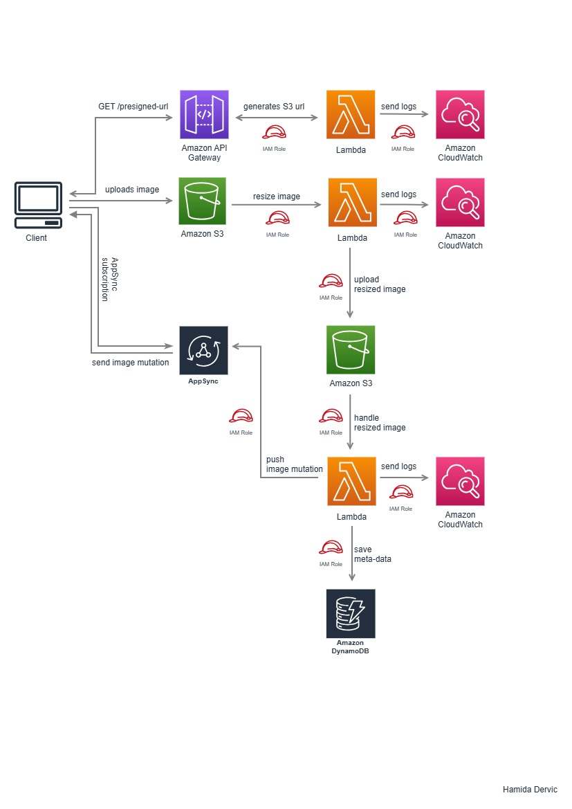

# Serverless Image Processing Application (AWS)

## Introduction
This project is a **fully serverless, event-driven architecture** built on AWS. It uses **Angular** for the frontend client, **Java** for backend AWS Lambda functions, and **Terraform** to define and deploy all AWS infrastructure. The system automatically processes images uploaded by clients, stores metadata, and delivers real-time updates through AWS services, demonstrating a scalable and maintainable cloud-native solution.

---

## Architecture Diagram

  
*Figure 1: Serverless, event-driven image processing workflow on AWS.*

---

## Workflow

1. A client, built with **Angular**, uploads an image by sending a request to **Amazon API Gateway**.  
2. API Gateway invokes an **AWS Lambda** function (written in **Java**) that generates a **pre-signed S3 URL** for secure image upload.  
3. The client uploads the image directly to the **source S3 bucket** using the pre-signed URL.  
4. The **S3 ObjectCreated event** triggers a second **AWS Lambda** function, which:
   - Resizes the image  
   - Stores the processed image in a **destination S3 bucket**  
5. The upload of the resized image triggers another **S3 ObjectCreated event**, invoking a third **AWS Lambda** function that:
   - Extracts and stores image metadata in **Amazon DynamoDB**  
   - Publishes the update to **AWS AppSync** using a GraphQL mutation  
6. Since the client is continuously subscribed to **AppSync**, it automatically receives the notification and the newly resized image metadata in real time.  

---

## Architecture Highlights

- **Frontend:** Angular – client interface for uploads and real-time updates  
- **Backend / Compute:** Java-based AWS Lambda functions for all serverless logic  
- **API Layer:** Amazon API Gateway  
- **Storage:** Amazon S3 (source and processed buckets)  
- **Database:** Amazon DynamoDB (image metadata)  
- **Real-time Updates:** AWS AppSync with GraphQL subscriptions  
- **Infrastructure as Code:** Terraform for reproducible, version-controlled deployment  
- Fully **serverless & event-driven**  
- Direct S3 uploads using **pre-signed URLs**  
- Asynchronous processing triggered by **S3 events**  
- Real-time client updates via **AppSync subscriptions**  

---